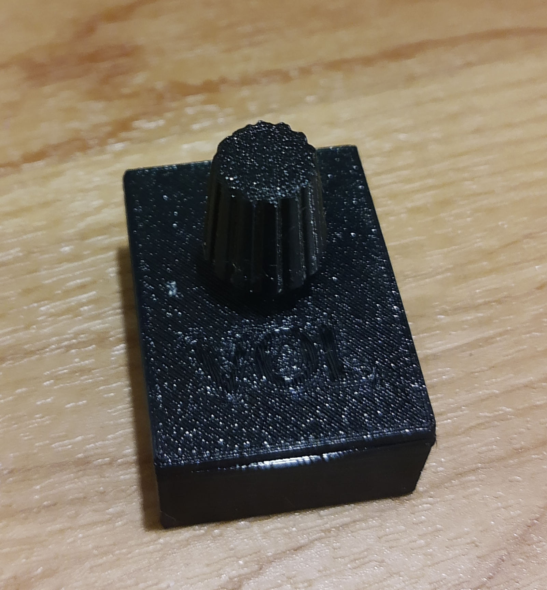

# minivolumidi Project

minivolumidi is a simple midi controller via wifi and [rtpMIDI](https://www.tobias-erichsen.de/software/rtpmidi.html) / apple network MIDI, based on a [Wemos D1 mini (ESP8266)](https://www.wemos.cc/en/latest/d1/d1_mini.html) and a KY-40 rotary encoder that is intended to act as a volume controller. By default a short button press sets the CC value to the configured ``MIN_POS`` and a long button press sets it back to the value before the short button press.

This project is based on the following sources:
* https://github.com/lathoub/Arduino-AppleMIDI-Library/tree/master/examples
* https://github.com/LennartHennigs/ESPRotary/tree/master/examples
* https://github.com/FortySevenEffects/arduino_midi_library/tree/master/examples
* https://www.thingiverse.com/thing:2814909
* https://www.thingiverse.com/thing:3646462

Thanks to all the nice people making qick projects like this possible by their contributions to the open source world! 


(more pictures in the ``img`` folder)

## prerequirements for building the hardware

* [Wemos D1 mini (ESP8266)](https://www.wemos.cc/en/latest/d1/d1_mini.html)
* a micro usb cable
* a KY-40 rotary encoder
* some wires
* soldering iron
* a 3d printer (if you want to print the case for it)
* hot glue gun
## prerequirements for building the software

* install [Platformio Core](https://docs.platformio.org/en/latest/core/installation.html) or [Platformio IDE](https://docs.platformio.org/en/latest/integration/ide/vscode.html#ide-vscode) (which installes Pio core automatically)
* clone this repository
```
git clone https://github.com/Apfelwurm/minivolumidi.git
```
## build (Visual Studio Code)

* open the cloned repo in VSCode

```
code minivolumidi
```

* open the ``src/main.cpp`` file and adapt the values in the configure section according to your requirements. 
* open the ``platformio.ini`` file and change the ``upload_port`` to your needs (most likely ``/dev/ttyUSB0`` on linux and ``COM3`` on windows)
* Press f5 to build it.
* Press the ``PlatformIO:Upload`` button at the bottom navigation of vscode to flash your wemos d1.

## build (CLI)

You can instead go to the repo folder with your terminal and run

```
pio run
```

respectively

```
pio run -t upload
```

depending if you want to just build or directly upload it to your wemos d1.

## enclosure

You can find a 3d printable enclosure and the rotary encoder knob files in the ``case`` subdirectory.
To print everything you can just use the ``case/wemos_stack_with_rotary_knob.stl`` in your favorite slicer.
For customizing of the case or if you dont want to print the knob, look into the ``case/wemos_stack.scad`` and adjust it to your needs.

## building the hardware

* print your case
* flash your Wemos d1
* bend the pins on your KY-40 rotary encoder so they face in the opposite direction as the rotary encoder or desolder them
* solder the KY-40s + pin to 3.3v of the Wemos
* solder the KY-40s GND pin to GND of the Wemos
* solder the KY-40s SW pin to configured ``BUTTON_PIN`` of the Wemos (dont use D8!) (default D5)
* solder the KY-40s CLK pin to configured ``ROTARY_PIN2`` of the Wemos (default D7)
* solder the KY-40s DT pin to configured ``ROTARY_PIN1`` of the Wemos (default D6)
* insert the KY-40 into the lid of the case (maybe you have to widen the hole a little bit for that)
* try to shorten the outstanding KY-40s pins on the bottom (be careful that you dont break something)
* fill the gapps between the KY40 and the lid with hotglue as good as possible and cover the whole back of the KY-40 with a 3-4mm thick layer of it. Be careful to clean all hot glue that will block the lids closing mechanism
* put the wemos in the case and close the lid with the KY-40 by pressing it together with the case
* put some hotglue into the rotary knob and press it on the rotary encoder
## using the hardware on windows

* install [rtpMIDI](https://www.tobias-erichsen.de/software/rtpmidi.html) on your target machine
* initially connect your minivolumidi via usb to your pc, open a serial terminal and press the small reset button on the left side with a needle. You should now get a serial print out of the IP address, the name and the port of your minivolumidi. 
* open rtpMIDI, add a session on the left side and enable it on the right side.
* add the minivolumidi in the ``Directory`` section with the data you gathered from the serial terminal
* press connect and test if it shows the connected client with a latency on the right side
* if everything works, you can now power the wemos everywhere in the wifi range of the configured network, without the usb connection and connect it via rtpMIDI
* open your DAW of choise and enable the rtpMIDI input and output channels
* map the midi parameter to whatever you want to control with it. Because of the wifi latency its not really useful for instant controls, but its perfect as a simple volume controller.

## contributions

if you want to contribute to the project or if you have problems, dont hesetate to open issues or submit pull requests.


